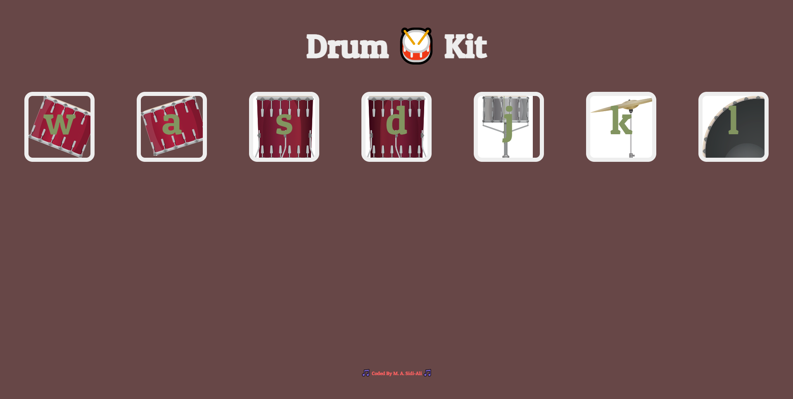

# Drum Kit Website

## Table of contents

- [Overview](#overview)
  - [The project](#the-drum-kit)
  - [Screenshot](#screenshot)
  - [Links](#links)
- [My process](#my-process)
  - [Built with](#built-with)
  - [What I learned](#what-i-learned)
  - [Continued development](#continued-development)
  - [Useful resources](#useful-resources)
- [Author](#author)

## Overview

### The Drum kit website
- This website is made up of a number of keys that represent different drums in a drum set, and when any of the drums is clicked, the corresponding sound is heard.
- The sound is also heard when the letters are pressed on the keyboard.

### Screenshot

Below is a screenshot of my drum kit Website.

### Link

- Live Site URL: [Live Site](https://sidi-ali.github.io/drumKit3/)

## My process

I used a desktop-first workflow to complete this project.

### Built with

- HTML5
- CSS
- flexbox
- JavaScript
- DOM

### What I learned

I learned more about the Document Object Model (DOM) and some advanced JavaScript.

### Continued development

I will be learning some JavaScript frameworks.

### Useful resources

- [JavaScript eventListener](https://developer.mozilla.org/en-US/docs/Web/API/EventTarget/addEventListener)

## Author

- linkedin - [M. A. Sidi-Ali](https://www.linkedin.com/in/muhammad-adamu-sidi-ali-907a486b/)
